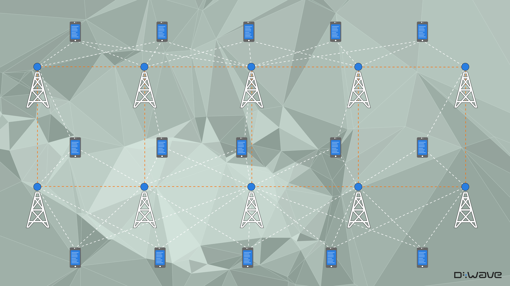
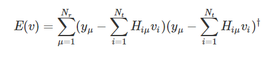
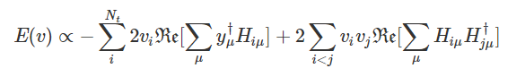
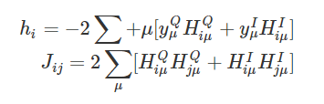

[](
  https://codespaces.new/dwave-examples/coordinated-multipoint-notebook?quickstart=1)

# Decoding Cellphone Signals

In wireless networks, such as cellular and Wi-Fi networks, 
[MIMO](https://en.wikipedia.org/wiki/MIMO) is an essential method of increasing 
transmission capacity: it uses multiple antennas to exploit 
[multipath propagation](https://en.wikipedia.org/wiki/Multipath_propagation). 
In one variation, 
[coordinated multipoint (CoMP)](https://en.wikipedia.org/wiki/Cooperative_MIMO),
neighboring cellular base stations jointly process received signals to reduce 
transmission-decoding errors.



High-quality decoding techniques are computationally expensive, especially in
dense urban areas, characterized by high noise (low signal-to-noise ratios, SNR) 
and load (large numbers of cellphones per base station). Consequently, network 
providers are in need of ways to reduce high operational cost and power demand. 

This notebook demonstrates the use of a quantum computer in decoding transmissions 
in CoMP problems and compares performance to decoding methods currently in use in 
cellular networks. 

## Installation

You can run this example
[in the Leap IDE](https://ide.dwavesys.io/#https://github.com/dwave-examples/cooperative-multipoint).

Alternatively, install requirements locally (ideally, in a virtual environment):

    pip install -r requirements.txt

## Usage

To run the notebook:

```bash
jupyter notebook
```

[^1]: Leap's IDE, which runs VS Code, does not support all notebook extensions. 

## Problem Formulation

MIMO requires effective and efficient demultiplexing of mutually-interfering 
transmissions. Contemporary base stations use linear filters such as 
[Matched filter](https://en.wikipedia.org/wiki/Matched_filter) and 
[minimum mean squared error (MMSE)](https://en.wikipedia.org/wiki/Minimum_mean_square_error). 
However, these methods perform poorly in dense urban environments as the ratio 
of cellphones to base stations and noise increase[[1]](#1). Additionally, complete 
(or verifiable) decoding techniques, such as sphere decoding, improve throughput 
but demand computational resources that grow exponentially with network size. 
Power consumption, therefore, is a problem. A quantum computer, in contrast, can 
provide powerful computational abilities with low power needs. To solve the 
decoding problem with a quantum computer, you formulate it as a 
[binary quadratic model](https://docs.dwavesys.com/docs/latest/c_gs_workflow.html).  

The decoding problem is to find a sequence of symbols, with the length of the 
number of transmitters, that minimizes the difference between the received 
signal and the sequence of symbols acted upon by the problem Hamiltonian, 
which represents the wireless channels of transmission. That is,  


and the objective function is given by:



with the external summation on the receivers (e.g., base stations),
the internal summations on the transmitters (e.g., cellphones), and 
the Hermitian transpose denoted with the dagger symbol.  


Reference [[2]](#2) below formulates the transmission-decoding problem as an 
Ising model and you can see Ocean software's implementation in 
[dimod](https://docs.ocean.dwavesys.com/en/stable/docs_dimod/sdk_index.html).

In brief, in the case of BPSK handled by this example, symbols are 1 or -1, 
and you can reduce the objective to,



The Ising model's coefficients are then given by,



where superscript Q and I denote imaginary and real parts, respectively. 

### References

<a name="1">[1]</a> Toshiyuki Tanaka. 
A Statistical-Mechanics Approach to Large-System Analysis of CDMA Multiuser Detectors.
IEEE TRANSACTIONS ON INFORMATION THEORY, VOL. 48, NO. 11, NOVEMBER 2002

<a name="2">[2]</a> Minsung Kim, Davide Venturelli, and Kyle Jamieson. 
Leveraging quantum annealing for large MIMO processing in centralized radio access networks.
SIGCOMM '19: Proceedings of the ACM Special Interest Group on Data Communication, August 2019, Pages 241–255 
https://dl.acm.org/doi/10.1145/3341302.3342072

## License

See [LICENSE](LICENSE.md) file.
